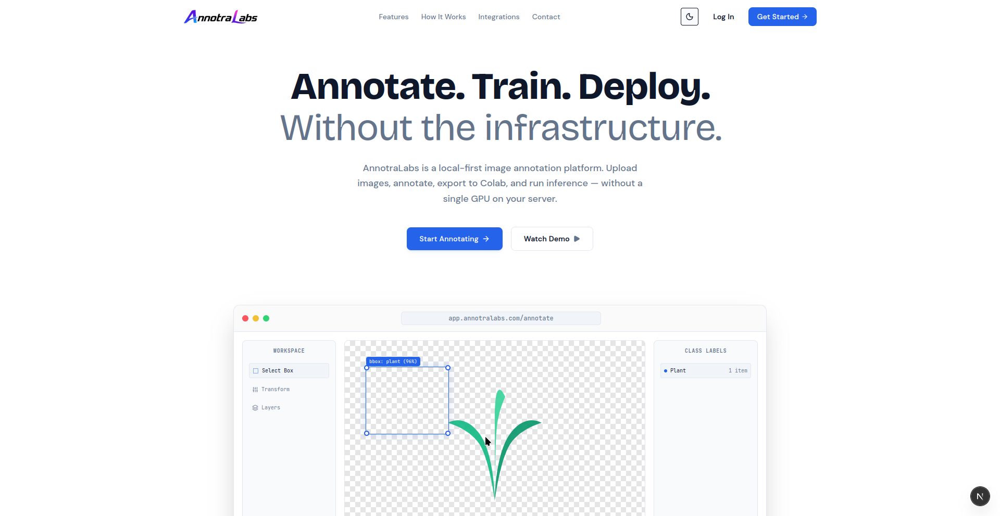

# AnnotraLabs

**Open, local-first image annotation — without the GPU bill.**

---

## What We Do

AnnotraLabs is a free, local-first alternative to paid annotation platforms like Roboflow. We're building a tool that lets you:

- **Upload & annotate images** — bounding boxes, multi-class labeling, no limits on image count
- **Preprocess datasets** — grayscale, rotate, crop, flip, augment — right in the browser
- **Export training-ready datasets** — YOLO format, zipped, synced to Google Drive
- **Train without local compute** — auto-generated Colab notebooks for YOLOv8 and other vision models, using free GPU/TPU
- **Understand your model in plain English** — Gemini-powered analysis of your training graphs (loss, mAP, precision/recall)
- **Run live inference** — expose your trained model from Colab via a tunnel, connect it to our dashboard, and test predictions instantly

No paywalls. No image caps. No "1K API calls a month."

---

## Why

Every annotation tool we tried was either too limited on the free tier or assumed you already had a GPU. We didn't. So we're building the tool we wished existed — one that treats Google Colab as the training backend instead of requiring you to pay for compute you don't have.

---

## Status

🚧 **We are actively building AnnotraLabs right now.** This org will host the core repos as they're released:

| Component | Description | Status |
|---|---|---|
| `annotralabs-web` | Next.js frontend — annotation canvas, dashboard | In Progress |
| `annotralabs-api` | Golang backend — storage, auth, Drive sync | In Progress |
| `annotralabs-colab` | Colab notebook templates for training/inference | Planned |
| `annotralabs-cli` | CLI for dataset export and Colab bridge | Planned |

---

## Preview

> Screenshots will be added here as the UI is built out.

|  |

---

## Tech Stack

`Next.js` · `TypeScript` · `Golang` · `PostgreSQL` · `Konva.js` · `Google Colab` · `YOLOv8` · `Gemini API` · `Cloudflare Tunnel`

---

## Follow Along

This is an early-stage, in-progress build. Star the repos to follow development as features ship.

**Built by ML engineers who didn't have a GPU either.**

